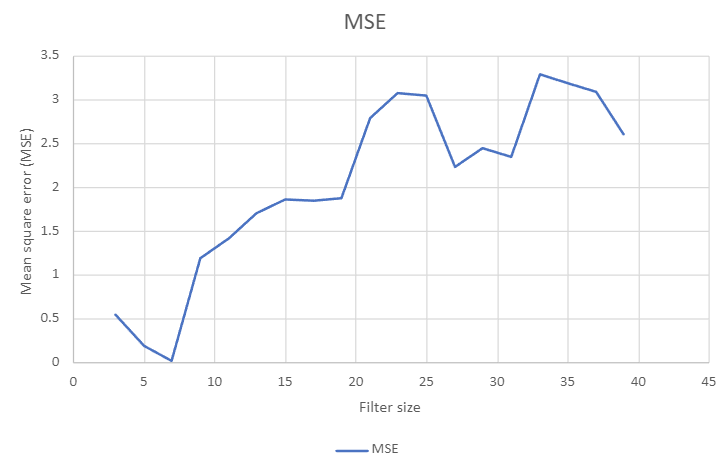
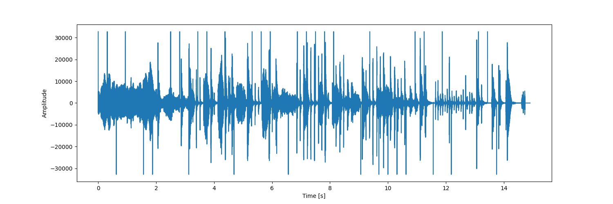
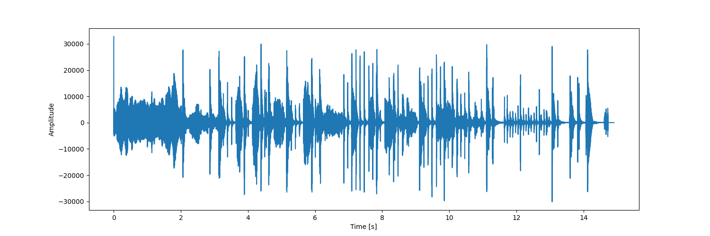
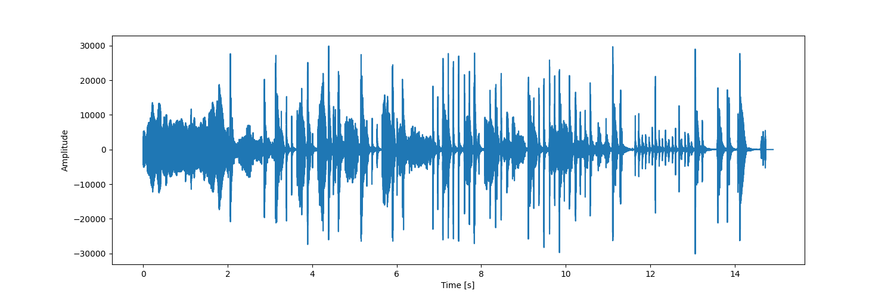
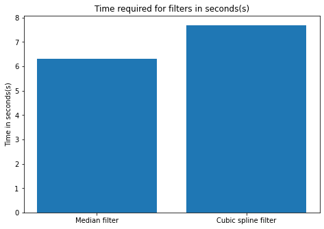
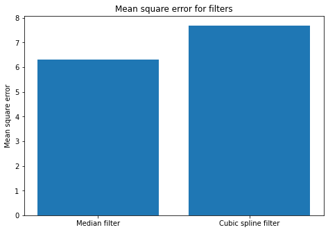

# Audio restoration using Median filter and Cubic splines 


 

## Short Description of the project 

This project is built on Assignment_1 (Trinity College Dublin) of Computational Methods in the M.Sc. Electronic Information Engineering Course. Assignment_1 is about degrading a clean signal, detecting the clicks and filtering it using Autoregressive methods. 

 
 

For more details, check the report of [Assignmnet_1](https://github.com/AakashRevankar/Auto_regressive_filter/blob/main/55C22_Assignment1.pdf). 

 
 

--- 

The ```deg.wav``` (degraded_audio) , ```error_points.mat``` (detection_signal) are obtained from this [demo.m](https://github.com/AakashRevankar/Auto_regressive_filter/blob/main/demo.mp). 

 
 

This file contains two interpolating filters. They are: 

 
 

- median filter - ```audio.py``` 

- cubic splines - ```cubic_spline.py``` 

 
 

--- 

## Long Description of the project  

 
 

### Steps involved in median filter : 

- The degraded data is extracted from ```deg.wav``` and it's converted into an input list. The median filtering is applied only at the clicks. Let the inp_list be [6, 1, 8, 2, 3] 

- The inp_list is padded depending on the filter size. But the program works only for odd numbered filter size and throws an error for even numbered filter size.  

- If filter size is N, the padded_list will have (N+1)/2 0's padded into inp_list, so the filter can read the initial value. For instance, the initial value for filter size 3 is [0, 6, 1]. 

- After padding, the list is sorted and median for each padded_list of filter size is found and the output list will be [0, 1, 6]. 

- Lastly, we get the restored signal value using median filter and the MSE is calculated. 

 
 

### Steps involved in cubic spline filter: 

- The degraded data is extracted from ```deg.wav``` and it's converted into an input list and the data is indexed. 

- The data around the clicks of filter_size number is removed. The new data and removed index array are given to inbuilt cubic_spline function. 

- The cubic_spline function predicts the missing index value, and it is trained to new data. 

- Lastly, we get the restored signal from cubic spline and the MSE is calculated. 

 
 
 
 
 

--- 

## Installation and Execution 

To run this program in your system, please create a virtual environment and run the below line: 

 
 

```sh                                  
pip install -r requirements.txt 
``` 

The requiremets.txt contains the following libraries: 

 
 

``` 
matplotlib==3.6.2 
numpy==1.23.4 
playsound==1.2.2 
scikit_learn==1.1.3 
scipy==1.9.3 
tqdm==4.64.1 
``` 

The required python libraries for this project are installed. For more details about pipreqs check [here](https://note.nkmk.me/en/python-pip-install-requirements/). 

 
 
 

Afer installing all required packages you can run the demo file simply by typing: 

```sh 
python audio.py 
python cubic_spline.py 
``` 

--- 

 
 

## Methodology  

The main function is `audio.py` contains `myfiler` function and ``sysfilter`` function. 

The main function contains two-unit tests created using `unitTest` function. The function tests the ``length`` and the ``value`` of restored and original signal. 

## Results 

1. For the median filter, different lengths of filter size were explored to test the effectiveness of the restoration and the MSE is calculated. 20 different filter sizes were tested, and it was observed that filter size= 7 delivers the lowest MSE, as shown in the table and we can conclude from the graph below. 
 

2. The destorted, restored waveform <res_a.wav> using the median filter with the optimal filter length is given below: 
 
 

 
 

3. Using the cubic splines, we observe that output waveform has no clicks. 
The restored waveform <res_c.wav> with the optimal filter length is given below:
 

 
 

4. Comparing the two different interpolation methods, we notice that Median filter with filter_size = 7 has a lower MSE than the cubic spline filter. The runtime of median_filter is 0.020869349 seconds and for cubic_spline_filter is 0.326341945 seconds. 
 
 
 
 

4. After listening to the two restored signals, we notice that we have restored the signal clearly from the clicks. 

--- 

## Credits 

This code was developed for purely academic purposes by Aakash Revankar (AAK2511) as part of Audio_filter audio restoration assignmnet. 


Resources: 

- Dr Angeliki Katsenou's notes 

- [Cubic spline documentary](https://docs.scipy.org/doc/scipy/reference/generated/scipy.interpolate.CubicSpline.html) 

 